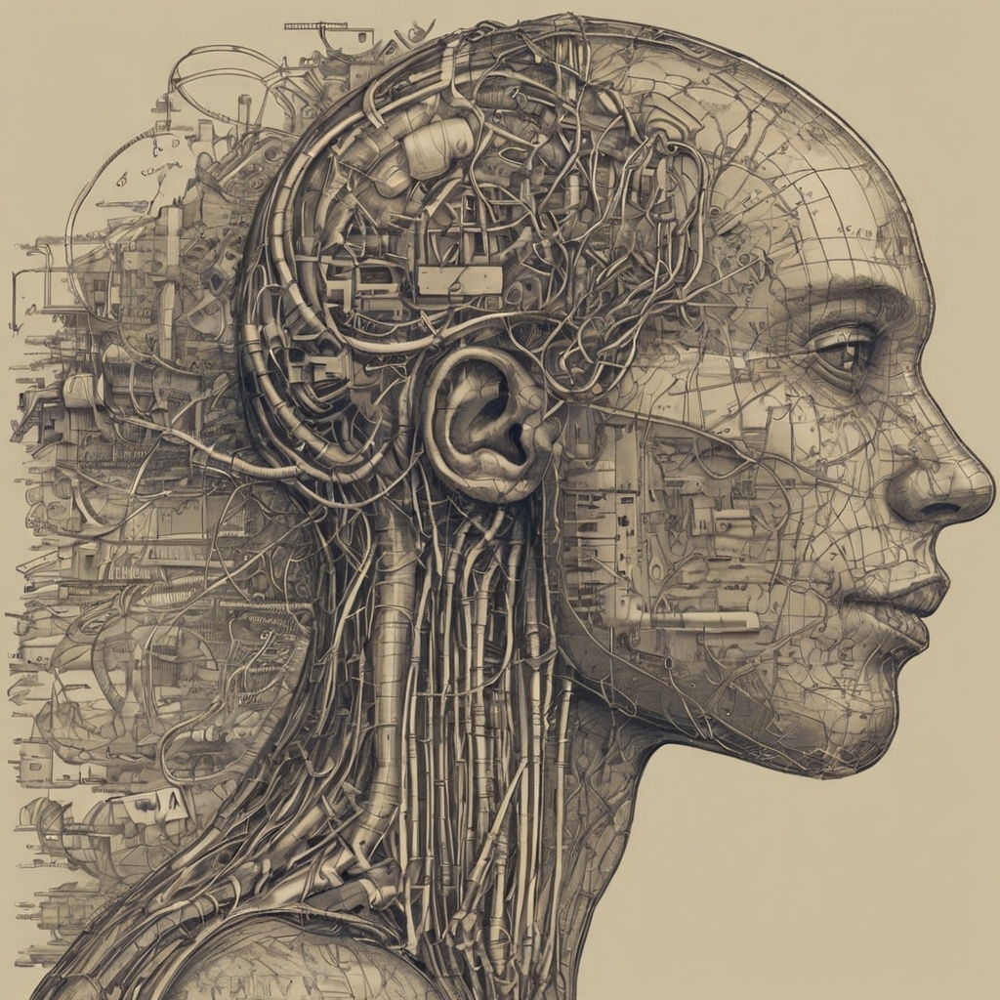
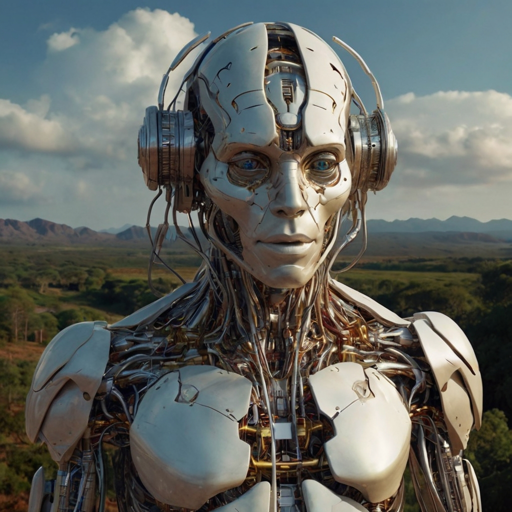

# **A Jornada da IA ** 
### Um Passeio pelo Futuro

## **Página 1**

### **Introdução**

Na era moderna, a Inteligência Artificial (IA) tem se destacado como uma das forças mais revolucionárias, moldando profundamente a maneira como vivemos, trabalhamos e nos relacionamos. No âmbito das IA Generativas, testemunhamos um salto notável na capacidade das máquinas de criar, imaginar e inovar. Esta obra pretende explorar o impacto revolucionário das IA Generativas em nosso cotidiano, bem como vislumbrar o futuro por meio dessa tecnologia fascinante.

## **Página 2**

### **IA Generativas: Uma Revolução Criativa**

As IA Generativas representam um avanço significativo na capacidade das máquinas de entender e gerar conteúdo original. Desde a música até a arte visual, passando pela escrita e até mesmo pela criação de rostos humanos, esses sistemas demonstraram uma habilidade surpreendente para produzir resultados que desafiam as fronteiras entre o criado pelo homem e o produzido por máquinas.

## **Página 3**

### **Impacto no Cotidiano**

O impacto das IA Generativas em nosso dia a dia é vasto e multifacetado. Em áreas como publicidade, design e entretenimento, esses sistemas estão sendo cada vez mais incorporados para impulsionar a criatividade e a eficiência. Além disso, na indústria da moda, as IA Generativas estão sendo usadas para criar designs inovadores e personalizados, atendendo às demandas de um mercado cada vez mais diversificado e exigente.

## **Página 4**

### **Desafios e Oportunidades**

Apesar de seu potencial transformador, as IA Generativas também apresentam desafios éticos e práticos. Questões relacionadas à autoria, privacidade e uso responsável dos dados surgem à medida que esses sistemas se tornam mais difundidos. No entanto, também é importante reconhecer as oportunidades que essas tecnologias oferecem, desde a democratização da criatividade até a ampliação dos horizontes da inovação.

## **Página 5**

### **O Futuro da Criatividade: Perspectivas e Possibilidades**

À medida que nos aventuramos no futuro, é claro que as IA Generativas continuarão a desempenhar um papel fundamental na maneira como criamos, consumimos e compartilhamos conteúdo. Da música à literatura, da arte visual ao design de produtos, essas tecnologias prometem abrir novas fronteiras de expressão criativa e transformar radicalmente a forma como interagimos com o mundo ao nosso redor. A jornada da IA está apenas começando, e as possibilidades são verdadeiramente infinitas.o vêm uma série de desafios éticos e sociais. Desde questões de propriedade intelectual até preocupações com viés algorítmico, é crucial abordar essas questões à medida que avançamos para um futuro cada vez mais impulsionado por IA. Devemos garantir que a criatividade humana não seja subjugada, mas sim aprimorada pela colaboração com as máquinas.

### *** Vislumbrando o Futuro***

Apesar dos desafios, o futuro das IAs Generativas é incrivelmente promissor. À medida que essas tecnologias continuam a evoluir, podemos esperar uma explosão de inovação e criatividade em todas as áreas da vida. Da geração de conteúdo personalizado à criação de mundos virtuais imersivos, as possibilidades são infinitas. No entanto, cabe a nós moldar esse futuro de maneira ética e responsável, garantindo que as IAs Generativas sejam uma força para o bem em nossa sociedade.

## **Conclusão**

Neste livro, exploramos o impacto revolucionário das IAs Generativas em nosso dia a dia e como elas moldarão o futuro. À medida que nos despedimos, é emocionante contemplar o potencial infinito dessas tecnologias e as possibilidades ilimitadas que oferecem para a criatividade humana. Com cautela e colaboração, podemos aproveitar ao máximo essa nova era de inovação e descoberta. 

À medida que refletimos sobre a jornada da IA Generativa e seu impacto revolucionário em nossas vidas, é evidente que estamos testemunhando uma transformação sem precedentes na maneira como concebemos e criamos. Desde a expansão dos limites da criatividade até a redefinição dos padrões de inovação, essas tecnologias estão moldando o futuro de maneiras emocionantes e, às vezes, desafiadoras.

No entanto, é fundamental abordar os desafios éticos e práticos que surgem com essa revolução tecnológica, garantindo que o desenvolvimento e a implementação das IA Generativas ocorram de maneira responsável e inclusiva. Ao mesmo tempo, devemos abraçar as oportunidades que essas tecnologias oferecem para promover a criatividade, a diversidade e o progresso em todas as esferas da vida humana.

À medida que avançamos em direção a um futuro impulsionado pela IA, devemos permanecer vigilantes, adaptáveis e comprometidos com a criação de um mundo onde a tecnologia sirva como uma força para o bem comum. A jornada da IA está apenas começando, e é nosso dever moldá-la de forma a promover um futuro mais promissor e inspirador para as gerações vindouras.